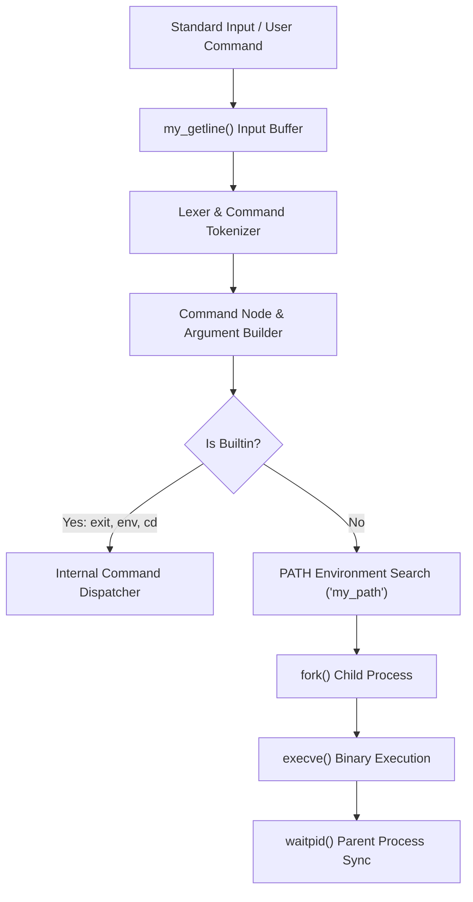

# simple_shell: UNIX Command Line Interpreter in C

A standards-compliant UNIX command language interpreter written in C, implementing interactive and non-interactive command execution, process lifecycle management, path resolution, and builtin commands.



## Core Subsystems

`simple_shell` mimics the core operational behavior of POSIX shells such as `sh` and `dash`:

### Subsystem Breakdown

- **Input Line Reader (`my_getline.c`)**: Custom zero-dependency line reader handling dynamic buffer allocations, newline trimming, and EOF detection without relying on GNU `getline`.
- **Command Tokenizer & Chains (`chain.c`, `my_string_fun.c`)**: String lexer splitting input streams into executable tokens while managing command separator logic (`;`, `&&`, `||`).
- **Path Resolution (`my_path.c`)**: Searches system directories specified in the `PATH` environment variable, validating executable permissions using `stat(2)`.
- **Process Orchestration (`my_hsh.c`)**: Manages process execution via `fork(2)` and `execve(2)`, tracking termination status codes and signal interrupts (`SIGINT`).
- **Builtin Dispatcher (`builtin_emlatours.c`, `env.c`)**: Executes internal shell operations without process branching:
  - `exit`: Clean termination with exit status codes.
  - `env`: Prints active process environment variables.
  - `cd`: Modifies current working directory and updates `PWD` / `OLDPWD`.
  - `alias`: Shell alias storage and resolution.

## Compilation & Usage

### Interactive Mode

```bash
gcc -Wall -Werror -Wextra -pedantic -std=gnu89 *.c -o hsh
./hsh
$ /bin/ls -la
$ exit
```

### Non-Interactive Mode

```bash
echo "/bin/ls" | ./hsh
```
